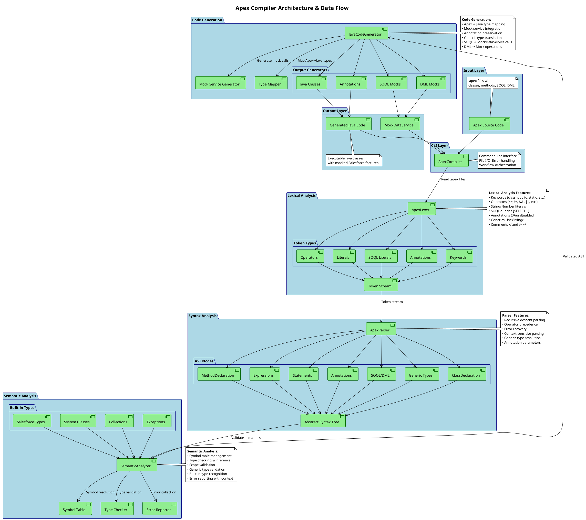
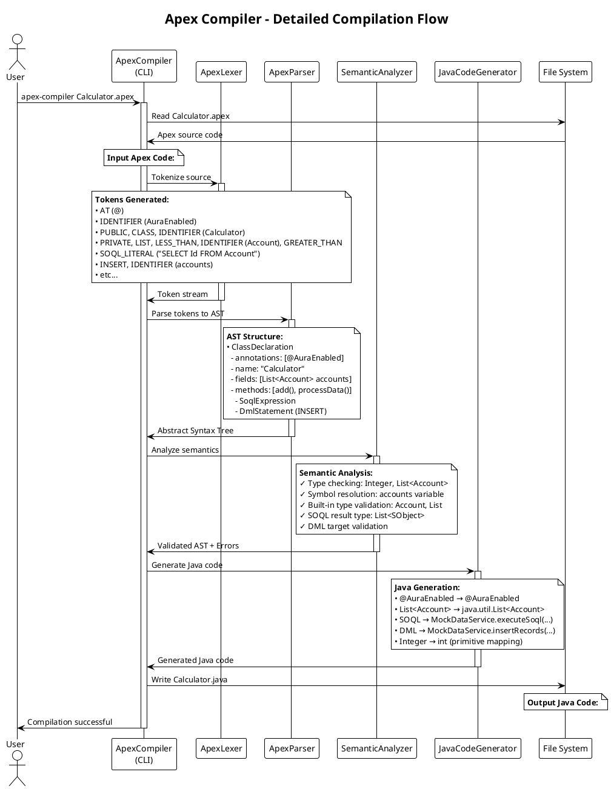

# Apex Compiler

A local Apex language compiler implementation in Java that translates Apex source code to Java.

## Features

- **Lexical Analysis**: Tokenizes Apex source code
- **Parsing**: Builds Abstract Syntax Tree (AST) from tokens
- **Semantic Analysis**: Type checking and symbol resolution
- **Code Generation**: Generates equivalent Java code
- **CLI Interface**: Command-line tool for compilation

## Supported Apex Features

- Class declarations with inheritance and interfaces
- Method declarations with parameters and return types
- Variable declarations and assignments
- Control flow statements (if/else, while, for)
- Expressions and operators
- Basic type system (Integer, Decimal, String, Boolean, etc.)
- Comments (single-line // and block /* */)

## Building

```bash
mvn clean compile
mvn package
```

## Usage

### Command Line Interface

```bash
java -jar target/apex-compiler-1.0.0.jar [OPTIONS] <input-file>
```

#### Options

- `-h, --help`: Show help message
- `-v, --version`: Show version information
- `-o, --output <dir>`: Output directory (default: current directory)
- `-c, --check`: Check syntax and semantics only, don't generate code
- `--verbose`: Enable verbose output

#### Examples

Compile an Apex file to Java:
```bash
java -jar target/apex-compiler-1.0.0.jar examples/Calculator.apex
```

Compile with custom output directory:
```bash
java -jar target/apex-compiler-1.0.0.jar -o build examples/Calculator.apex
```

Check syntax only:
```bash
java -jar target/apex-compiler-1.0.0.jar -c examples/Calculator.apex
```

Verbose compilation:
```bash
java -jar target/apex-compiler-1.0.0.jar --verbose examples/Calculator.apex
```

## Example

Input Apex file (`Calculator.apex`):
```apex
public class Calculator {
    private Integer result;
    
    public Integer add(Integer a, Integer b) {
        result = a + b;
        return result;
    }
}
```

Generated Java file (`Calculator.java`):
```java
// Generated from Apex source
import java.util.*;

public class Calculator {
    private int result;
    
    public int add(int a, int b) {
        result = (a + b);
        return result;
    }
}
```

## Project Structure

```
src/
├── main/java/com/apexcompiler/
│   ├── lexer/          # Lexical analysis
│   ├── parser/         # Syntax analysis
│   ├── ast/            # Abstract Syntax Tree nodes
│   ├── semantic/       # Semantic analysis
│   ├── codegen/        # Code generation
│   └── cli/            # Command-line interface
└── test/java/          # Unit tests
examples/               # Example Apex files
```

## Testing

Run unit tests:
```bash
mvn test
```

Test with example files:
```bash
java -jar target/apex-compiler-1.0.0.jar examples/HelloWorld.apex
java -jar target/apex-compiler-1.0.0.jar examples/Calculator.apex
```

## Architecture

The compiler follows a traditional multi-phase architecture with modern enhancements:



### **Component Details:**

1. **Lexer** (`ApexLexer`): Tokenizes input source code with support for SOQL, annotations, and generics
2. **Parser** (`ApexParser`): Builds AST using recursive descent parsing with error recovery
3. **Semantic Analyzer** (`SemanticAnalyzer`): Type checking, symbol resolution, and comprehensive validation
4. **Code Generator** (`JavaCodeGenerator`): Generates target Java code with mock service integration
5. **CLI Driver** (`ApexCompiler`): Command-line interface and workflow orchestration

### **Compilation Flow Example:**



## Recent Enhancements

✅ **Major improvements have been implemented:**

### ✅ Annotations Support
- Full support for Apex annotations (@AuraEnabled, @TestMethod, etc.)
- Annotation parameters with named and positional arguments
- Proper Java annotation generation

### ✅ Generics Support  
- Generic type parsing (List<String>, Map<Id, Account>, etc.)
- Type parameter resolution and validation
- Java generics generation with proper type mapping

### ✅ SOQL Query Support (Mocked)
- SOQL literal parsing with `[SELECT ... FROM ...]` syntax
- Mock data service for query execution
- Type-safe query result handling

### ✅ DML Operations Support (Mocked)
- Support for `insert`, `update`, `delete`, `upsert` statements
- Mock data service for DML operations
- Proper statement parsing and validation

### ✅ Enhanced Standard Library
- Comprehensive Salesforce type system (Account, Contact, Lead, etc.)
- System classes (System, Database, Test, Schema, etc.)
- Exception hierarchy (DmlException, QueryException, etc.)
- HTTP and JSON utilities

### ✅ Improved Parser
- Better error handling and recovery
- Fixed string literal parsing in return statements
- Enhanced type checking and validation
- Context-sensitive parsing for complex constructs

## Current Limitations

Remaining areas for improvement:

- Inner class support (planned)
- Advanced error reporting with better context
- Code optimization passes
- Some edge cases in complex expression parsing

## License

This project is for educational purposes.